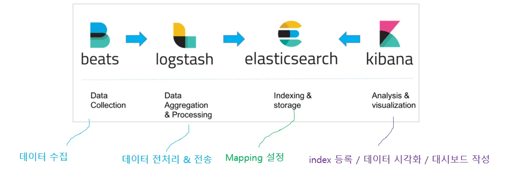
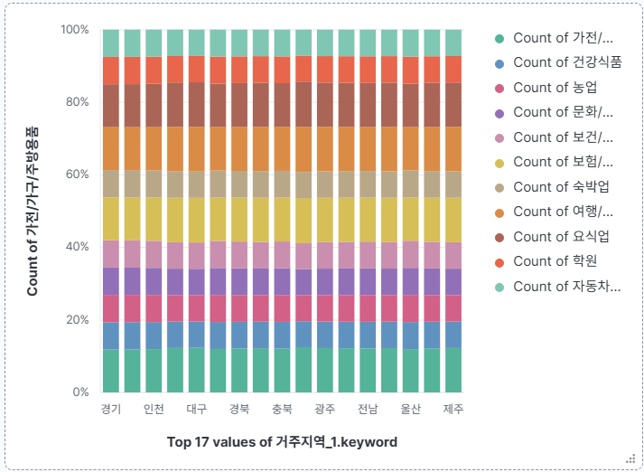
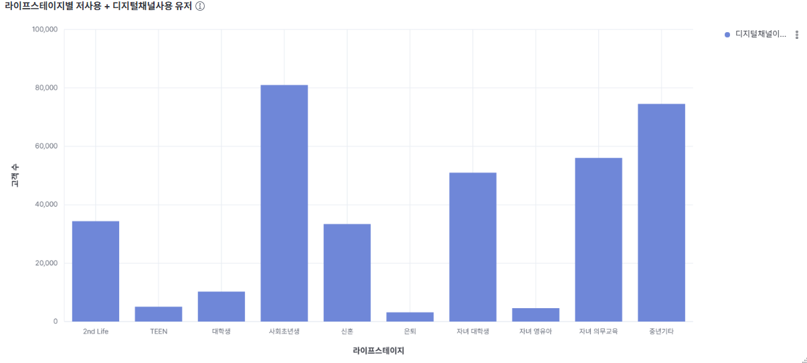
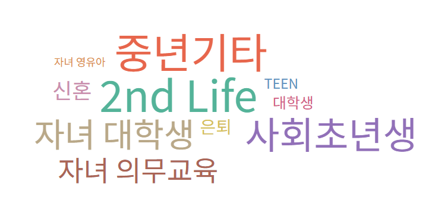
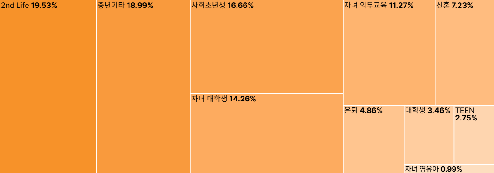
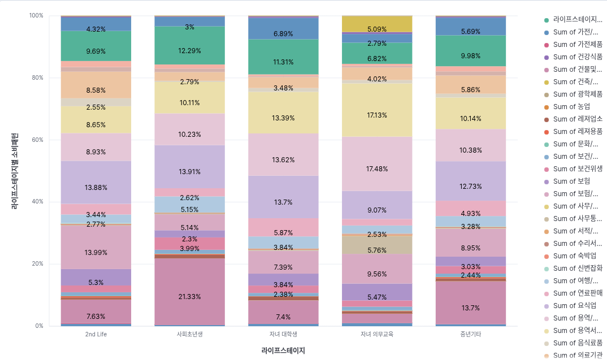

# 💳 우리카드 저사용 고객 활성화를 위한 데이터 분석 및 마케팅 전략 수립
> **우리 FISA 6기 클라우드 엔지니어링 과정 - ELK 스택 활용 실습 및 프로젝트**

## 👥 팀원 소개

|  |  |  |  |
| :------------------------------------------------------------------------------------------: | :------------------------------------------------------------------------------------------: | :------------------------------------------------------------------------------------------: | :-------------------------------------------------------------------------------------------: |
| **손정원** | **심규보** | **이승준** | **사재현** |
| [GitHub](https://github.com/handgarden) | [GitHub](https://github.com/Qbooo) | [GitHub](https://github.com/HiLeeS) | [GitHub](https://github.com/Zaixian5) |

### 🛠️ 역할 분담

| 이름 | 역할 |
|------|------|
| 손정원 | 파이프라인 구축 및 시각화 |
| 심규보 | 파이프라인 구축 및 시각화 |
| 이승준 | 파이프라인 구축 및 시각화 |
| 사재현 | 시각화 및 리드미 작성 |

## 1. 프로젝트 개요 (Overview)

### 🎯 프로젝트 주제
우리카드 데이터 분석을 통한 **저사용 고객의 카드 이용률 제고 전략** 수립

### 🚩 프로젝트 목표
- **ELK 파이프라인 구축 학습**: 대용량 데이터의 수집(Logstash), 저장(Elasticsearch), 분석(Kibana) 과정을 직접 구축하며 데이터 엔지니어링 역량 강화.


- **데이터 시각화 실습**: Kibana를 활용하여 원천 데이터에서 유의미한 비즈니스 인사이트를 도출하는 시각화 기법 습득.
- **기술 스택**:
   - 📈 **ELK 스택 (Elasticsearch · Logstash · Kibana)**
   - 🏢 **Git / GitHub** 
   - 🦆 **Duck DB**  
   - 🐼 **Pandas**

---


## 2. 🧠 전략 수립의 흐름 (Thought Process)

1.  **현황 파악**: 라이프스테이지별 카드 미사용 및 저사용 고객 수를 확인하여 핵심 타겟군 설정.
      > 저사용 고객의 기준은 총 이용 금액이 10만원 미만인 사용자로 정했음
2.  **가설 수립**: "저사용 고객에게 맞춤형 이벤트를 기획하여 푸시 알림을 보내면 이용률이 높아질 것이다."
3.  **타겟 최적화**: 저사용 유저 중 푸시 알람 확인 빈도가 높은 계층을 분석하여, 마케팅 효율이 가장 높을 것으로 예상되는 집단 선별.
4.  **세부 전략 기획**: 알림 확인율이 높은 **Top 5 라이프스테이지**의 실제 소비 패턴을 분석하여, 그들의 라이프스타일에 최적화된 맞춤형 이벤트 기획.

---

## 3. 왜 이 프로젝트가 중요한가? (Why This Matters)

### 🔎 카드 업계의 당면 과제
 * 현재 카드 시장은 포화 상태.
   * [신한·삼성·현대카드의 시장점유율이 각각 20%, 19%, 19%로 1%p 차이](http://m.ceoscoredaily.com/page/view/2025061315091272678)에 불과할 정도로 경쟁이 치열함. 

   * 이런 상황에서 카드사들은 두 가지 선택지에 직면함:
      1. **비용 집약형 전략**: 대규모 마케팅 비용 투입 (할인, 캐시백, 경품)
      2. **데이터 집약형 전략**: 정교한 타겟팅으로 효율 극대화 ⭐ (본 프로젝트 접근법)

* [카드사들은 고금리 환경 속 수익성 악화로 인해 비용을 크게 들이지 않고도 효과를 볼 수 있는 방법을 모색](https://dealsite.co.kr/articles/119763)하고 있음

### 📌 저사용 고객이 중요한 이유
   ```
   💳 활성 고객 1명 신규 유치 비용 >>> 저사용 고객 1명 활성화 비용
   ```

- **신규 고객 획득 비용**: 5-25배 더 비쌈 (업계 평균)
- **저사용 고객**: 이미 카드를 보유하고 있어 전환 장벽이 낮음
- **회원 이탈 방지**: 타사로의 이동 차단

### 🤔 왜 라이프스테이지 세분화인가?
* **전통적 세분화의 한계:**
   - 나이/성별만으로는 실제 소비 패턴 예측 불가
   - 같은 30대여도 "신혼", "자녀 영유아", "싱글"의 소비 패턴은 완전히 다름

* **라이프스테이지 세분화의 장점:**
   - 생애 주기에 따른 **실제 니즈** 반영
   - 소비 패턴의 **예측 가능성** 향상
   - **맞춤형 혜택** 설계 용이

### 🤔 왜 푸시 알림인가?
   * **데이터로 검증된 효과:**
      - [사용자 데이터 기반 푸시: 잠재고객의 48%가 구매 전환](https://www.nnt-consulting.com/성공적인-푸시-알림-마케팅-전략-11가지/)
      - [AI 기반 타겟팅: 전환율 9\~20% 증가, 이탈율 13\~31% 감소](https://blog.flarelane.co.kr/what_are_push_notifications/)
      - [29CM 사례: 개인화 푸시로 클릭률 6배 향상](https://www.cigro.io/post/2024-마케팅-종류-40가지와-성공사례)

   * **비용 효율성:**
      - SMS 대비 비용: 거의 무료
      - 이메일 대비 도달률: 60% vs 20-30%
      - 실시간 소통 가능

### ✨본 프로젝트의 차별점
```
푸시 알림 반응도 (행동 데이터) + 실제 소비 패턴 (거래 데이터)
→ 이중 검증된 타겟 그룹 도출
```

---

## 4. 🛠️ 트러블슈팅 (Trouble Shooting)

### 1) Colab 환경의 메모리 한계 및 Duck DB 사용법 미숙(Pandas/Duck DB → Logstash/Elastic search 이관)
* **문제 상황**: 
    * 수백만 건의 대용량 카드 결제 데이터(CSV)를 분석하기 위해 Pandas의 `read_csv`를 시도했으나, Colab 환경의 **RAM 할당량 초과(Out of Memory)** 로 인해 커널이 강제 종료됨.
    * 다른 방법으로 Duck DB를 활용한 분석을 시도했으나, 일부 복잡한 쿼리문에서 파싱 에러 빈번히 발생
* **해결 방안**: 
    * Duck DB, Pandas 대신 **Logstash** 및 **Elasting search**로 데이터 이관

### 2) Logstash 데이터 재수집 불가 현상 (sincedb 이슈)
* **문제 상황**: 
    * Logstash 설정 파일(.conf) 수정 후 재실행 시, 에러 메시지는 없으나 **새로운 데이터가 Elasticsearch로 적재되지 않고 멈춰 있는 현상** 발생.
* **원인 분석**: 
    * Logstash의 `file` input 플러그인은 파일을 어디까지 읽었는지 기록하는 **`sincedb`** 파일을 생성함. 
    * 테스트 과정에서 동일한 파일을 반복해서 읽어야 했으나, Logstash는 해당 파일을 이미 끝까지 읽은 것으로 간주하여 추가 동작을 수행하지 않음.
* **해결 방안**: 
    * 입력(input) 설정에 `sincedb_path => "NUL"` (Windows 기준) 옵션을 추가하여 파일 읽기 기록을 남기지 않도록 설정.
    * `start_position => "beginning"` 옵션을 함께 사용하여 실행 시마다 파일의 처음부터 다시 읽도록 강제함으로써 성공적으로 데이터 재수집을 완료함.

        ```ruby
            # 해결된 Logstash Input 설정 예시
            input {
                file {
                    path => "C:/wooricard.csv"
                    start_position => "beginning" 
                    sincedb_path => "NUL" # Windows 환경에서 기존 읽기 기록을 무시하고 처음부터 다시 읽도록 설정(리눅스는 /dev/null)
                }
            }
        ```
### 3) 의미있는 값을 도출하기 어려운 그래프 도출


* **문제 상황**: 
   * 지역별로 주요 소비업종 고객수를 비교 했는데 차이가 없음.

* **원인 분석**:
   * 데이터를 선별해서 제공하는데에 있어서 전문적인 데이터 제공 기준이 있는것이 아닌가 생각됨.
* **해결 방안**:
   * count 값이 아닌, 총 이용 금액의 sum 값을 활용하니 의미있는 데이터를 도출할 수 있었음.

## 5. 📊 Kibana 데이터 시각화 (Visualizations)

> **분석의 논리적 단계**
> ```text
> [1단계] 현황 파악
>   ↓
> [2단계] 기회 발견
>   ↓
> [3단계] 타겟 선정
>   ↓
> [4단계] 전략 수립
> ```

## 6. 🧹 데이터 집계 및 전처리
### Filebeats 📦

- csv 데이터를 Logstash로 전달
```yml
filebeat.inputs:
    - type: filestream
      id: wooricard-stream
      enabled: true
      paths:
        - C:/wooricard.csv
```

### Logstash 🔄
- Filebeat에서 전달된 데이터를 집계, 변환, 저장

```groovy

# 1. CSV 파일 파싱
filter {
    csv {
    separator => ","
    skip_header => true
    columns => [
      "SEX_CD", "TOT_USE_AM"]
    }

    # 2. 한글로 변환
    mutate {
        rename => {
            "SEX_CD" => "성별"
            "TOT_USE_AM" => "총이용금액"
        }
    }

    # 3. 값 변환
    translate {
        field => "성별"
        destination => "성별"
        dictionary => {
            "1" => "남성"
            "2" => "여성"
        }
        override = true
    }

    # 4. 타입 변환
    mutate {
        convert => {
            "총이용금액" => "integer"
        }
    }

    # 5. 데이터 필터
    if [총이용금액] == 0 {    
        drop {}  
    }
}

```

## 7. 📊 Kibana 데이터 시각화 (Visualizations)

### ① 라이프스테이지별 고객 분포 (미사용/저사용/활성)

* **목적**: 어떤 그룹이 카드 사용률을 늘릴 잠재력이 있는가?
* **내용**: 각 라이프스테이지(사회초년생, 은퇴기 등)별 카드 미사용, 저사용, 활성 고객 비중 확인.
* **인사이트**: 어떤 계층이 가장 잠재력이 높은지 판단하는 근거.
* **분석결과**: 아래 순서대로 저사용 고객의 비중이 높았음.
   ```text
   중년 기타 > 2nd Life > 사회초년생 > 대학생 > 자녀 대학생 > 은퇴 > 자녀 의무 교육 > 신혼 > 자녀 영유아
   ```


> 

* **주요 발견:**
   - **중년 기타**: 절대 고객 수가 가장 많음 (약 170만명)
      - 미사용: 165만명
      - 저사용: 30만명
      - 활성: 90만명
  
   - **2nd Life**: 두 번째로 큰 그룹
      - 상대적으로 활성 고객 비율이 높음
      - 구매력 있는 시니어 층
 
### ② 저사용 유저의 푸시 알림 확인 수
* **내용**: 알림에 민감하게 반응하는 핵심 타겟층 선별.
* **인사이트**: 반응률이 높은 계층을 우선 공략하여 마케팅 비용 대비 고효율 달성.
* **분석결과**: 아래 순서대로 푸시 알림 반응률이 높았음
   ```text
   2nd Life > 중년 기타 > 사회초년생 > 자녀 대학생 > 자녀 의무 교육 > 신혼 > 은퇴 > 대학생 > TEEN > 자녀 영유아
   ```




> 

* **통계적 근거:**
   - [업계 평균 푸시 클릭률: 3%](https://blog.flarelane.co.kr/5-stats-about-push-notifications-you-didnt-know/)
   - 타겟팅 시 클릭률: 6-8% (2배 이상 향상)
   - [개인화 적용 시: 클릭률 최대 6배](https://www.cigro.io/post/2024-마케팅-종류-40가지와-성공사례)


### ③-1 Top 5 라이프스테이지 카드 사용 분석
* **목적**: 카드 종류에 따른 마케팅 전략 수립의 필요성을 확인
* **내용**: 각 라이프스테이지 별로 신용카드와 체크카드 중 무엇을 더 사용하는가?
* **인사이트**: 신용카드와 체크카드 간의 특화된 혜택 기획의 기반.
* **분석결과**: 모든 라이프스테이지에서 신용카드 사용 비중이 가장 높았음.


### ③-2 Top 5 라이프스테이지 소비 패턴 분석

* **목적**: 어떤 혜택을 제공해야 하는가?
* **내용**: 알람 반응률이 높은 상위 5개 그룹이 실제로 주로 어디에 돈을 쓰는지 분석.
* **인사이트**: 해당 업종(마트, 배달, 주유 등)에 특화된 혜택 기획의 기반.
* **분석결과**: 
   * 모든 라이프스테이지에서 일반적으로 유통에 가장 많은 소비를 보였고, 유통을 제외한 주요 소비 업종 Top3는 아래와 같음
      * **2nd Life**
         * 보험/병원 13.99 ⭐
         * 요식업 13.88
         * 일반/휴게음식 9.69

      * **사회초년생**
         * 건물및시설관리 21.33 ⭐
         * 요식업 13.91
         * 일반/휴게음식 12.29

      * **자녀 대학생**
         * 요식업 13.7 ⭐
         * 용역/수리/건축자재 13.62
         * 용역서비스 13.39

      * **자녀 의무 교육**
         * 용역/수리/건축자재 17.48 ⭐
         * 용역서비스 17.13
         * 요식업 9.07

      * **중년 기타**
         * 건물및시설관리 13.7 ⭐
         * 요식업 12.73
         * 용역/수리/건축자재 10.38
   ```text
   각 그룹의 소비 패턴이 명확히 구분됨
   → One-Size-Fits-All 마케팅은 비효율적
   → 그룹별 맞춤형 혜택 설계 필수
   ```
   


> 

---

## 8. 💡 최종 분석 결과 및 마케팅 전략

### 📈 분석 결론
데이터 분석 결과, 저사용 고객 중에서 **[2nd Life]** 계층이 푸시 알람 확인율이 가장 높았으며, 이들은 주로 **[보험/병원]**, **[요식업]** 에서 소비하는 경향을 보였음

### 🎁 제안하는 마케팅 전략
* **목표**: 빠른 성과 창출로 전략 유효성 입증
* **타겟**: Top 3 그룹 (전체 푸시 반응의 55% 차지)

##### 1-1. 2nd Life 헬스케어 캠페인 (우선순위 🥇)
```text
타겟 규모: 저사용 고객 중 19.53%
핵심 니즈: 건강 관리 (병원 지출 13.99%)
```

* **프로모션:**
   - 병원/약국 결제 5% 추가 적립 (3개월)
   - 건강검진 센터 10% 할인 제휴
   - 헬스/요가 센터 첫 달 무료

* **푸시 메시지 예시:**
   ```
   "건강한 시니어 라이프를 위한 특별 혜택
   병원 결제 5% 추가 적립 + 건강검진 할인까지!"
   ```

* **예상 성과 (보수적 추정):**
   - 푸시 클릭률: 6-8% ([개인화 타겟팅 효과](https://blog.flarelane.co.kr/what_are_push_notifications/))
   - 클릭 후 전환율: 48% ([데이터 기반 푸시 효과](https://www.nnt-consulting.com/성공적인-푸시-알림-마케팅-전략-11가지/))
   - **최종 활성화율: 3-4%**
   - ROI: 10-15배 (카드 프로모션 평균)

##### 1-2. 중년 기타 라이프스타일 캠페인
```text
타겟 규모: 최대 (저사용 30만명 추정)
핵심 니즈: 다양한 생활 편의 (시설관리 13.7%, 요식 12.73%)
```

   * **프로모션:**
      - 외식 10% 할인 (주말 한정)
      - 생활 서비스 통합 5% 적립
      - 주유소/마트 2% 추가 할인
      - 수도세, 전기세 등 시설 관리비 5% 할인

##### 1-3. 사회초년생 성장 지원 캠페인
```text
타겟 규모: 저사용 고객 중 16.66%
핵심 니즈: 중년 기타와 마찬가지로 다양한 생활 편의 (시설관리 21.33%, 요식업 13.91)
```

   * **프로모션:**
      - 외식 10% 할인 (주말 한정)
      - 생활 서비스 통합 5% 적립
      - 주유소/마트 2% 추가 할인
      - 수도세, 전기세 등 시설 관리비 5% 할인

#### 1-4. 첫 사용 인센티브
- 캠페인 기간 내 첫 사용 시 5,000원 캐시백
- 3회 이상 사용 시 추가 10,000원 (습관 형성 유도)
   1.  **개인화 타겟팅**: 반응률이 높은 상위 5개 라이프스테이지 고객에게 우선적으로 푸시 알림 발송.
   2.  **맞춤형 이벤트**: 소비 패턴 분석 결과를 바탕으로, 해당 고객군이 자주 이용하는 업종에 대해 **'우리카드 결제 시 추가 적립/할인'** 프로모션 진행.
   3.  **이탈 방지**: 미사용 기간이 길어지는 고객에게는 재방문 유도 쿠폰을 발행하여 카드 이용 습관 재형성 유도.

> **마케팅 전략 제안 3줄 요약:**
> 1. 975만 건 데이터 분석 결과, **저사용 고객층 중 푸시 알림 반응률 상위 5개 그룹** 을 타겟
> 2. 각 그룹별 **명확한 소비 패턴 차이** 확인 → 맞춤형 혜택 설계 가능
> 3. [업계 검증된 전환율 (48%)](https://www.nnt-consulting.com/성공적인-푸시-알림-마케팅-전략-11가지/) 적용 시, **저사용 고객 20% 활성화 → 연간 거래액 15-20% 증가** 예상

---

## 9. 프로젝트 요약

본 프로젝트는 **"데이터는 있으나 활용하지 못하는"** 카드사의 전형적 문제를 해결한다

1. ✅ **대용량 실데이터 (975만 건) 처리 및 분석 완료**
2. ✅ **통계적으로 유의미한 세그먼트 발견**
3. ✅ **실행 가능한 마케팅 전략 제시**

### 1) 핵심 성공 요인
```
📊 데이터 품질 (Real 거래 데이터)
   +
🎯 분석 방법론 (라이프스테이지 세분화)
   +
💡 실행 전략 (단계적 접근)
   +
📈 검증된 채널 (푸시 알림)
   =
💰 비용 효율적 고객 활성화
```

### 2) 확장 가능성

   * **타 금융사 적용:**
      - 은행: 예금/적금 저사용 고객 활성화
      - 보험사: 휴면 계약자 재활성화
      - 증권사: 계좌 개설 후 미거래 고객 전환

   * **타 산업 적용:**
      - 이커머스: 장바구니 이탈 고객
      - OTT: 구독 유지율 향상
      - 유통: 멤버십 비활성 고객

### 3) 마지막 한 마디

> "가장 좋은 고객은 이미 우리 손 안에 있습니다.  
> 다만 그들이 필요로 하는 것을 제대로 제공하지 못했을 뿐입니다."

> 975만 건의 데이터가 증명하듯, **저사용 고객은 기회**입니다.  
> 데이터 기반의 맞춤형 전략으로 이들을 활성화하는 것,  
> 그것이 포화된 카드 시장에서 살아남는 유일한 방법입니다.

---

**🙏 감사합니다!**


## 📚 참고 자료 및 근거 (References)

### 1) 카드 산업 동향
1. **카드사 시장점유율 경쟁 심화**
   - [불 뿜는 마케팅 경쟁…1위 경쟁 신한·현대·삼성카드 '3파전' - CEO스코어데일리](http://m.ceoscoredaily.com/page/view/2025061315091272678)
   - 신한·삼성·현대카드의 점유율 격차가 1%p 내외로 좁혀지며 고객 확보 경쟁 격화

2. **카드사의 고객 유지 전략**
   - [기자수첩: 카드사의 씁쓸한 마케팅 - 딜사이트](https://dealsite.co.kr/articles/119763)
   - 시장점유율이 곧 경쟁력, 비용 효율적인 고객 유치 방안 필요

3. **카드 프로모션 효과**
   - [이커머스 매출 성장의 핵심 전략: 카드 프로모션 최적화하기](https://openads.co.kr/content/contentDetail?contsId=15435)
   - 실제 사례: 프로모션 기간 거래액 2배 증가, ROAS 2,000% 달성

### 2) 푸시 알림 마케팅 효과성
4. **푸시 알림의 전환율**
   - [성공적인 푸시 알림 마케팅 전략 11가지 - NNT Consulting](https://www.nnt-consulting.com/성공적인-푸시-알림-마케팅-전략-11가지/)
   - 데이터 기반 푸시 알림: 잠재고객의 48%가 인앱 구매로 전환
   - 앱 리텐션 3~10배 향상 효과

5. **AI 기반 타겟팅 성과**
   - [앱 푸시 소개 및 구성 요소 - 플레어레인](https://blog.flarelane.co.kr/what_are_push_notifications/)
   - AI 기반 고객 타겟팅: 전환율 9~20% 증가, 이탈율 13~31% 감소
   - 푸시 알림 시장 2026년까지 89.5억 달러 규모 예상 (CAGR 31.5%)

6. **개인화 푸시의 위력**
   - [2024 마케팅 종류 40가지와 성공사례 - Cigro](https://www.cigro.io/post/2024-마케팅-종류-40가지와-성공사례)
   - 29CM 사례: 개인화 푸시 알림으로 클릭률 6배 향상

7. **푸시 알림 통계**
   - [푸시 알림에 대해 우리가 몰랐던 5가지 사실 - 플레어레인](https://blog.flarelane.co.kr/5-stats-about-push-notifications-you-didnt-know/)
   - 하루 평균 46개 푸시 알림 수신, 유저의 42%가 맞춤형 알림 원함

### 3) 데이터 기반 마케팅
8. **카드사 데이터 활용 마케팅**
   - [카드사 마케팅 카드사 결제데이터 활용해서 마케팅 해볼까 - 브런치](https://brunch.co.kr/@@zIH/5507)
   - 결제 데이터 기반 정교한 타겟팅으로 전환율 극대화

9. **카드사 통신사 문자광고 사례**
   - [카드사 통신사 문자광고, 자사에 어떻게 활용할 수 있을까?_사례 편](https://www.openads.co.kr/content/contentDetail?contsId=13091)
   - 코어타겟 문자광고로 실질적 전환 가능성 높은 고객 확보

### 4) 소비 트렌드
10. **2024 소비 패턴 분석**
    - [[비즈니스 인사이트] 마음을 읽어라…2024년 소비 패턴 ABCDE - 한국경제](https://www.hankyung.com/article/2023111979171)
    - 라이프스테이지별 차별화된 소비 패턴 및 마케팅 접근 필요

11. **라이프스타일 기반 소비**
    - [대학내일20대연구소: 라이프스타일 품목 소비 기획조사 2024](https://www.20slab.org/Archives/38668)
    - MZ세대 라이프스타일별 소비 행태 분석

---
본 프로젝트에서 사용된 우리카드 데이터는 우리 FISA 6기 과정에서 제공 받았습니다. 데이터 외부 유출 금지 서약을 작성하고 사용한 데이터입니다.
