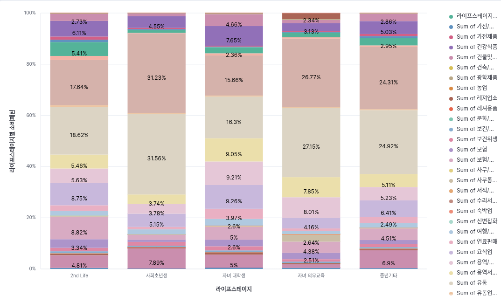

# 💳 우리카드 저사용 고객 활성화를 위한 데이터 분석 및 마케팅 전략 수립
> **우리 FISA 6기 클라우드 엔지니어링 과정 - ELK 스택 활용 실습 및 프로젝트**

## 👥 팀원 소개
| 이름 | 역할 | GitHub |
| :--- | :--- | :--- |
| **[손정원]** | 파이프라인 구축 및 시각화 | [](https://github.com/handgarden) |
| **[심규보]** | 파이프라인 구축 및 시각화 | [](https://github.com/Qbooo) |
| **[이승준]** | 파이프라인 구축 및 시각화 | [](https://github.com/HiLeeS) |
| **[사재헌]** | 시각화 및 리드미 작성 | [](https://github.com/Zaixian5) |

---

## 1. 프로젝트 개요 (Overview)

### 🎯 프로젝트 주제
우리카드 데이터 분석을 통한 **저사용 고객의 카드 이용률 제고 전략** 수립

### 🚩 프로젝트 목표
* **ELK 파이프라인 구축 학습**: 대용량 데이터의 수집(Logstash), 저장(Elasticsearch), 분석(Kibana) 과정을 직접 구축하며 데이터 엔지니어링 역량 강화.
* **데이터 시각화 실습**: Kibana를 활용하여 원천 데이터에서 유의미한 비즈니스 인사이트를 도출하는 시각화 기법 습득.

---

## 2. 🧠 전략 수립의 흐름 (Thought Process)

1.  **현황 파악**: 라이프스테이지별 카드 미사용 및 저사용 고객 수를 확인하여 핵심 타겟군 설정.
2.  **가설 수립**: "저사용 고객에게 맞춤형 이벤트를 기획하여 푸시 알림을 보내면 이용률이 높아질 것이다."
3.  **타겟 최적화**: 저사용 유저 중 푸시 알람 확인 빈도가 높은 계층을 분석하여, 마케팅 효율이 가장 높을 것으로 예상되는 집단 선별.
4.  **세부 전략 기획**: 알림 확인율이 높은 **Top 5 라이프스테이지**의 실제 소비 패턴을 분석하여, 그들의 라이프스타일에 최적화된 맞춤형 이벤트 기획.

---

## 3. 🛠️ 트러블슈팅 (Trouble Shooting)

### 1. 로컬 환경의 메모리 한계 (Pandas/DuckDB → Logstash 이관)
* **문제 상황**: 
    * 수백만 건의 대용량 카드 결제 데이터(CSV)를 분석하기 위해 Pandas의 `read_csv`를 시도했으나, Colab 및 로컬 환경의 **RAM 할당량 초과(Out of Memory)**로 인해 커널이 강제 종료됨.
    * DuckDB를 활용한 분석을 시도했으나, 일부 복잡한 쿼리문에서 파싱 에러 빈번히 발생
* **해결 방안**: 
    * Duck DB, Pandas 대신 **Logstash** 및 **Elasting search**로 데이터 이관

### 2. Logstash 데이터 재수집 불가 현상 (sincedb 이슈)
* **문제 상황**: 
    * Logstash 설정 파일(.conf) 수정 후 재실행 시, 에러 메시지는 없으나 **새로운 데이터가 Elasticsearch로 적재되지 않고 멈춰 있는 현상** 발생.
* **원인 분석**: 
    * Logstash의 `file` input 플러그인은 파일을 어디까지 읽었는지 기록하는 **`sincedb`** 파일을 생성함. 
    * 테스트 과정에서 동일한 파일을 반복해서 읽어야 했으나, Logstash는 해당 파일을 이미 끝까지 읽은 것으로 간주하여 추가 동작을 수행하지 않음.
* **해결 방안**: 
    * 입력(input) 설정에 `sincedb_path => "NUL"` (Windows 기준) 옵션을 추가하여 파일 읽기 기록을 남기지 않도록 설정.
    * `start_position => "beginning"` 옵션을 함께 사용하여 실행 시마다 파일의 처음부터 다시 읽도록 강제함으로써 성공적으로 데이터 재수집을 완료함.

        ```ruby
            # 해결된 Logstash Input 설정 예시
            input {
                file {
                    path => "C:/wooricard.csv"
                    start_position => "beginning" 
                    sincedb_path => "NUL" # Windows 환경에서 기존 읽기 기록을 무시하고 처음부터 다시 읽도록 설정(리눅스는 /dev/null)
                }
            }
        ```

---

## 4. 📊 Kibana 데이터 시각화 (Visualizations)

### ① 라이프스테이지별 고객 분포 (미사용/저사용/활성)
* **내용**: 각 라이프스테이지(사회초년생, 은퇴기 등)별 카드 미사용, 저사용, 활성 고객 비중 확인.
* **인사이트**: 어떤 계층이 가장 잠재력이 높은지 판단하는 근거.
* **분석결과**: 


> 

### ② 저사용 유저의 푸시 알람 확인 수
* **내용**: 알람에 민감하게 반응하는 핵심 타겟층 선별.
* **인사이트**: 반응률이 높은 계층을 우선 공략하여 마케팅 비용 대비 고효율 달성.
* **분석결과**: 


> 

### ③ Top 5 라이프스테이지 소비 패턴 분석
* **내용**: 알람 반응률이 높은 상위 5개 그룹이 실제로 주로 어디에 돈을 쓰는지 분석.
* **인사이트**: 해당 업종(마트, 배달, 주유 등)에 특화된 혜택 기획의 기반.
* **분석결과**: 
    - 일반적으로 유통에 가장 많은 소비
    - 유통을 제외하고
        - 2nd Life -> 병원
        - 사회초년생 -> 건물및시설관리
        - 자녀대학생 -> 요식업
        - 자녀 의무교육 -> 용역/수리/건물자재
        - 중년 -> 건물및시설관리


> 

---

## 5. 💡 최종 분석 결과 및 마케팅 전략

### 📈 분석 결론
데이터 분석 결과, **[특정 라이프스테이지]** 계층이 푸시 알람 확인율이 가장 높았으며, 이들은 주로 **[특정 업종]**에서 소비하는 경향을 보였음

### 🎁 제안하는 마케팅 전략
1.  **개인화 타겟팅**: 반응률이 높은 상위 5개 라이프스테이지 고객에게 우선적으로 푸시 알림 발송.
2.  **맞춤형 이벤트**: 소비 패턴 분석 결과를 바탕으로, 해당 고객군이 자주 이용하는 업종에 대해 **'우리카드 결제 시 추가 적립/할인'** 프로모션 진행.
3.  **이탈 방지**: 미사용 기간이 길어지는 고객에게는 재방문 유도 쿠폰을 발행하여 카드 이용 습관 재형성 유도.

---
본 프로젝트에서 사용된 우리카드 데이터는 우리 FISA 6기 과정에서 제공 받았습니다. 데이터 외부 유출 금지 서약을 작성하고 사용한 데이터입니다.
